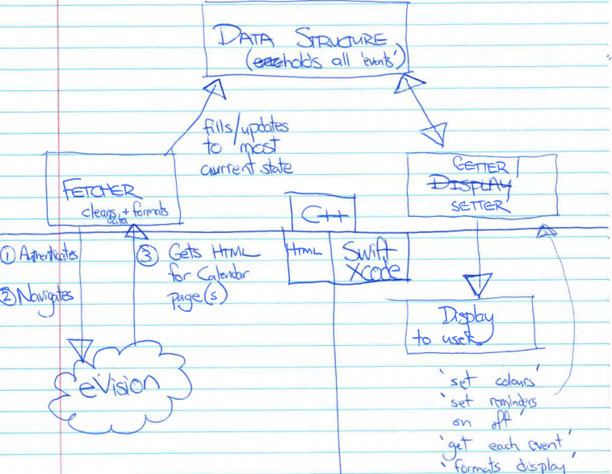

### COSC345
# Timetable App Project Codename: stoned-crone
## Assignment One

Alex Gregory | Nadja Jury | Will Shaw | William Warren

# What and why?
Many students find it relatively difficult to memorise their University timetable as it varies from semester to semester and sometimes from week to week. With the proliferation of double degrees and minors, students often find themselves taking a variety of papers and aren’t part of a habit forming cohort. They are unable to rely on a single group to know where to go next. What a dilemma. Parallel to this, accessing one’s timetable through the University’s eVision system is cumbersome, time consuming and delivers a poor user experience on a mobile device. To add insult to injury, there is no feature that allows students to receive notifications for upcoming classes, tests or tutorials, or to export these engagements to a calendar app.

Intuitively, we knew we’d use an app that solves these problems every week, if not every day - however, we wanted to understand exactly what attributes or functionalities were important to make this app appealing to students at large.
To better understand the approaches that students use to manage their class timetables, we spoke to a number of them and compiled some common approaches and their relative drawbacks.

## Analysis of current options
**eVision**
- Poor UX on mobile devices
- Requires Navigation to login page, entering username and password, scrolling, panning and clicking See More to load calendar
- No facility for notifications or export to calendar

**Mobile screenshot of eVision timetable**
- Static - does not capture changes to class times or locations or fortnightly tutorials etc.
- Image is eventually submerged on user’s ‘camera roll’
- No facility for notifications or export to calendar

**Manual entry into calendar application**
- Very time consuming relative to other options - large burden on user at beginning of each semester
- Allows notifications
- Requires accuracy and understanding of class behaviours e.g. no lab in first week, fortnightly tutorial etc.
- Static - does not capture any changes in the timetable

**Diary**
- Involves transcribing timetable into diary
- Unresponsive to changes in venue, fortnightly tutorials etc. unless you transcribe week by week
- Time consuming
- No notifications
- Most students already carry their phone - carrying a diary generally means another item to lose, forget or weigh you down

## So what are we going to build?
An iOS app that assists students to manage their day at University. To offer an improvement on the above tools it have the ability to:
- Pull timetable data from eVision with minimal user effort
- Rapidly display the calendar to the user in an intuitive way
- Notify the user of upcoming classes

# Who and how?
## Our people

Our group brings a diverse set of skills to this project. We have discussed our existing strengths and weaknesses, as well as the skills we would like to develop through our work on the project. We have assigned people to lead various tasks but plan to work together where it is efficient to do so.

Alex Gregory - Report Lead

_Alex will draft reports in consultation with the group and bring them together for review. He has some limited experience doing interface design in xcode which he will use to assist this aspect of the project._

Nadja Jury - Code Review Lead

_Nadja will review code as it is pushed to GitHub to ensure it ‘does what is says it does’ as well as for style and readability. Nadja will work closely with William to ensure that code entering review phase is being meaningfully tested, as well as with Will to ensure we are hitting appropriate functionality milestones._

Will Shaw - Development Lead

_Will is leading the development effort for this project which will include collaborating on specifications and delegating the development of aspects of the program to other members of the group as required._

William Warren - Test Lead

_William is leading our testing effort. With a particular interest in this area, he will try to break our program and communicate issues back to the group as he finds them so that they can be fixed._

## How are we going to build this application
_We’ve designed four high level components and identified tasks which are needed to assemble these._
### High Level Architecture Plan

**Data Structure**
- For each class store
  - Name
  - Type (tutorial, lab, lecture)
  - Start and Finish time

**Fetcher**
- Sends the login token to eVision
- Fetches HTML calendar page with C++
  - Parses and cleans this data and interfaces with the data structure object to create/update the events stored in it (time, place, colour, type)
  
**Getter / Setter**
- Has methods to read and wipe data structure
- Has methods to update certain parameters in the data structure e.g. a ‘reminder’ flag for each event
- Has methods to do searches e.g. only BSNS115, date range
- Passes data to Display in a sensible way so that it can be displayed to the user

**Display**
- Interfaces with setter/getter
- Sets options e.g. reminder
- Sends queries through getter e.g. day view, week view
- Makes things look pretty (displays engagements in a chart format)

## Scheduling

## Testing
We will be developing atoms to an agreed and documented specification. As we develop the components that make up each atom we will test them against the specification to ensure they “do what they say they do”. We have signed up for the Travis CI tool which will automatically compile and run tests as we push versions to our public github.

As in the gantt chart above, we are going to develop specifications for what we are building and then continually test what we have developed against those specifications. We will test each component of the application individually, trying to break it using edge cases as well as testings the application as a whole with a variety of users and devices.

Code reviews will be carried out before any branch is merged into master; which can help reduce the number of bugs brought into the code.

## Feasibility
**Technical**
Successful execution of the project will require:
- Experience in:
  - C++
  - iOS Development - Swift or Objective-C
- Access to:
  - macOS and xCode
  - iOS based devices or suitable in-built emulators
  
The group is currently working on a series of proof of concepts in C++ and Swift with the aim of increasing our technical competence.

**Resources**
Resources that can assist us with development are:
- [Apple's UI Design Language](https://developer.apple.com/design)
- [Apple’s Developer Application Programming Interface (API)](https://developer.apple.com/develop)
- [cURL Library API](https://curl.haxx.se/libcurl/c/)
- [C++ APIs](http://www.cplusplus.com/reference/)
- Computers Laboratories at Otago University
- Otago University Computer Science Faculty

## Risks Assessment and Treatment Plans
### Technical
**Issues pulling eVision data into C++ with cURL**
Alternative approaches to be explored
Proof of feasibility for this is currently a priority task 
Group to set go-no go milestone for this approach

### Introduced
**eVision (3rd party) update breaks code**
- Due to encapsulation only fetcher code needs to change significantly
- Monitor situation - they’ve recently performed a significant update so are perhaps unlikely to implement another significant one for some time

**Natural disaster**
- All team members have laptops and are able to work remotely

### Human
**People fall ill or are otherwise unavailable**
- Agreed commenting standards
- Documentation of architecture and methods
- Central repository in Github
- Tasks tracked in Asana
